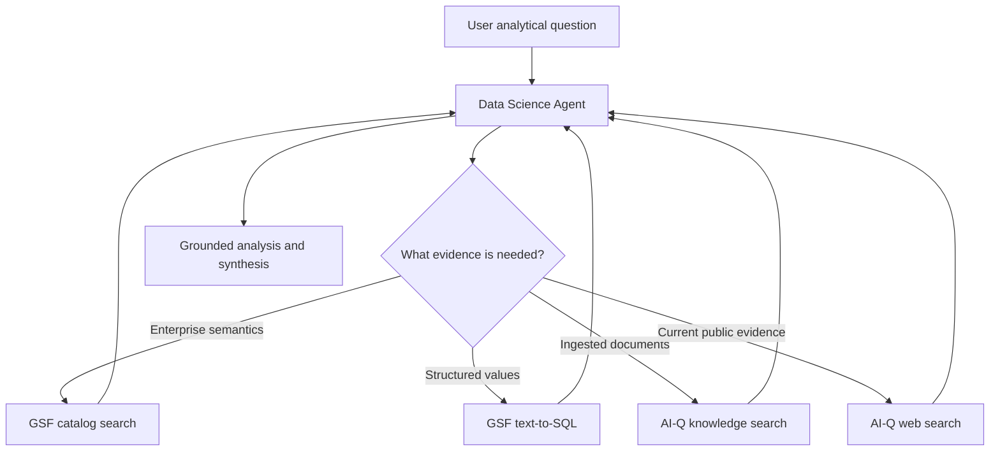

<!--
SPDX-FileCopyrightText: Copyright (c) 2026, NVIDIA CORPORATION & AFFILIATES. All rights reserved.
SPDX-License-Identifier: Apache-2.0
-->

# Data Science Agent

The Data Science Agent is an adaptive ReAct controller for questions that need
enterprise structured data, document evidence, public web evidence, or a
combination of those sources. It owns discovery, tool selection, analysis, and
final synthesis in one continuous message history.

**Location:** `src/aiq_agent/agents/data_science/`

The initial integration is deliberately exposed as a direct CLI workflow. It is
not yet connected to the top-level intent router.

## Tool integration

The agent receives tools through NeMo Agent Toolkit references and the
`data_source_registry`; it does not contain provider clients.

- `gsf__catalog_search` discovers query-relevant ontology candidates and entity
  coverage.
- `gsf__text_to_sql` generates validated SQL and returns bounded rows from GSF.
- `knowledge_search` uses the configured AI-Q knowledge backend.
- `web_search_tool` uses the configured AI-Q web-search provider.
- `analysis_workspace`, when explicitly configured, performs bounded,
  deterministic calculations over JSON-compatible evidence. It is a utility,
  not a citable data source.
- `python`, when configured through `stateful_python`, provides one persistent
  scientific Python kernel per request. It is also a non-citable utility.

An empty `tools` list inherits every registry tool. A non-empty list is an
explicit override, and `exclude_tools` can remove exact runtime tool names.
Per-request `data_sources` filtering uses the same registry mapping as the
shallow and deep researchers.

## Runtime flow



GSF calls are made sequentially so each later question can use exact entities or
values observed earlier. Document and web searches should be narrow enough to
represent distinct evidence needs. The final answer goes through AI-Q's source
registry, citation verification, and report sanitization.

The optional request-local GSF guard enforces configured catalog and
text-to-SQL call limits, serializes calls, caches exact repeats, and records
compact evidence diagnostics (coverage/candidate counts or row counts and
truncation). The agent prompt complements that boundary with an evidence ledger,
one broad catalog-discovery pass, consolidated analytical requests, and bounded
repair rules. Limits are opt-in so the general direct profile remains tunable.

The optional `bounded_python` NAT function uses an explicit workspace protocol:
the agent starts one random workspace per user task, reuses its ID for
calculations, and closes it afterward. JSON-compatible variables persist across
calls, while each execution occurs in a fresh subprocess with CPU, wall-time,
memory, payload, and output limits. Imports, attribute access, filesystem and
network APIs, and normal Python builtins are unavailable. This is intentionally
smaller than the provider-backed Deep Research sandbox.

For analyses that require pandas, NumPy, SciPy, scikit-learn, or statsmodels,
the `stateful_python` NAT function keeps a real Python subprocess alive for the
entire DS request. The runtime creates and closes the process; the model sees a
single `python(code)` tool and does not manage workspace identifiers. Every
successful GSF text-to-SQL response is persisted under a stable request-local
reference (`gsf_1`, `gsf_2`, and so on). The kernel exposes
`list_gsf_results()`, `gsf_result(ref)`, `gsf_rows(ref)`, `gsf_sql(ref)`, and
`gsf_latest()`, so analysis consumes exact rows rather than copying values from
the conversation. The kernel has no configured source-database or GSF client;
all retrieval remains an agent-level GSF operation.

The DS runtime also reserves a final model call before the LangGraph recursion
boundary. When that reserve begins, tools are removed and the model must
synthesize from collected evidence. In `fdabench_choice` mode, a missing or
malformed leading `Answer:` line receives one no-tool format-repair call.

## Direct local run

Copy `deploy/.env.example` to `deploy/.env` and set:

- `INFERENCE_NVIDIA_API_KEY`
- `AIQ_INFERENCE_BASE_URL`
- `TAVILY_API_KEY`
- `GSF_BASE_URL`
- `GSF_EMAIL`
- `GSF_PASSWORD`
- `RAG_SERVER_URL`
- `COLLECTION_NAME`

Optional variables include `GSF_READ_TIMEOUT_SECONDS`,
`RAG_RETRIEVAL_TIMEOUT_SECONDS`, `RAG_VERIFY_SSL`, and
`AIQ_DS_INTERACTION_MODE`. Then run:

```bash
./scripts/start_cli.sh --config_file configs/config_cli_data_science.yml
```

The local profile uses password-session authentication for GSF. Product
integration should omit that auth block and rely on AI-Q's request-scoped user
token forwarding.

The direct CLI profile uses the Foundational RAG backend for knowledge
retrieval. Its ingestion URL is intentionally fail-closed because this profile
only searches an existing collection. TLS verification remains enabled by
default; trusted test routes using a self-signed chain can set
`RAG_VERIFY_SSL=false` locally.

## Non-interactive evaluation

Set `AIQ_DS_INTERACTION_MODE=headless` for benchmark and batch execution. The
agent then uses semantic discovery to resolve ambiguity, discloses defensible
assumptions, and never waits for a user response. If the model still emits a
clarification request, the runtime performs one bounded synthesis retry; a
second clarification becomes a terminal non-interactive limitation.

## FDABench-Lite profiles

Two direct profiles isolate the planned ablation without involving the shallow
researcher or top-level router:

- `configs/config_cli_data_science_fdabench_lite.yml` runs DS ReAct with GSF,
  Foundational RAG, and Tavily.
- `configs/config_cli_data_science_fdabench_lite_python.yml` keeps the same
  model, source tools, GSF limits, and response contract, and adds only the
  persistent scientific Python kernel with exact GSF-result helpers.

Both profiles are headless and set `response_mode: fdabench_choice`. When a task
contains labeled choices, the prompt evaluates every option and emits an
`Answer:` line first while retaining rationale and sources below it. Report-style tasks
without choices still receive the standard analytical report. The benchmark
adapter must include the target database name and complete answer choices in the
user request.

Required benchmark variables are `INFERENCE_NVIDIA_API_KEY`,
`AIQ_INFERENCE_BASE_URL`, `GSF_BASE_URL`, `GSF_EMAIL`, `GSF_PASSWORD`,
`RAG_SERVER_URL`, `COLLECTION_NAME`, and `TAVILY_API_KEY`. Optional
`AIQ_DS_GSF_CATALOG_CALL_LIMIT` and `AIQ_DS_GSF_TEXT_TO_SQL_CALL_LIMIT`
override the profile defaults of two and six actual calls, respectively. Exact
request-local cache hits do not consume those budgets.
`AIQ_DS_PYTHON_CALL_LIMIT`, `AIQ_DS_PYTHON_TIMEOUT_SECONDS`, and
`AIQ_DS_FINALIZATION_MODEL_CALL_LIMIT` tune the persistent analysis and reserved
finalization turn.

These profiles configure the runtime surface only; they do not bundle FDABench
data, RAG documents, database files, endpoint URLs, or credentials.

## Current boundaries

- The top-level AI-Q router does not yet select this agent.
- Predictive/PQL execution is not exposed because the public GSF function group
  has not registered a validated prediction tool.
- Atomic-question clarification is planned separately and is not part of the
  direct workflow.
- The ReAct message/tool trajectory is observable through NAT tracing. Benchmark
  DAG materialization is not part of the production agent contract.
