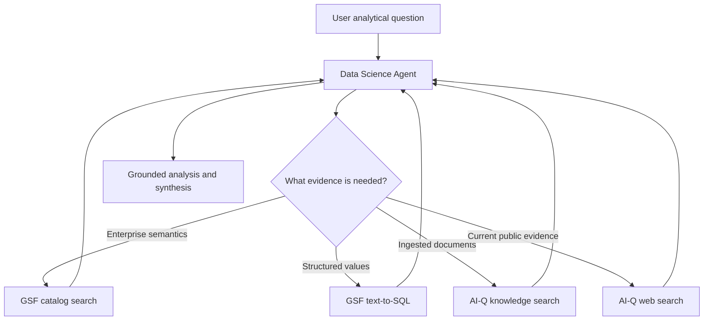

<!--
SPDX-FileCopyrightText: Copyright (c) 2026, NVIDIA CORPORATION & AFFILIATES. All rights reserved.
SPDX-License-Identifier: Apache-2.0
-->

# Data Science Agent

The Data Science Agent is an adaptive ReAct controller for questions that need
enterprise structured data, document evidence, public web evidence, or a
combination of those sources. It owns discovery, tool selection, analysis, and
final synthesis in one continuous message history.

**Location:** `src/aiq_agent/agents/data_science/`

The initial integration is deliberately exposed as a direct CLI workflow. It is
not yet connected to the top-level intent router.

## Tool integration

The agent receives tools through NeMo Agent Toolkit references and the
`data_source_registry`; it does not contain provider clients.

- `gsf__catalog_search` discovers query-relevant ontology candidates and entity
  coverage.
- `gsf__text_to_sql` generates validated SQL and returns bounded rows from GSF.
- `knowledge_search` uses the configured AI-Q knowledge backend.
- `web_search_tool` uses the configured AI-Q web-search provider.

An empty `tools` list inherits every registry tool. A non-empty list is an
explicit override, and `exclude_tools` can remove exact runtime tool names.
Per-request `data_sources` filtering uses the same registry mapping as the
shallow and deep researchers.

## Runtime flow



GSF calls are made sequentially so each later question can use exact entities or
values observed earlier. Document and web searches should be narrow enough to
represent distinct evidence needs. The final answer goes through AI-Q's source
registry, citation verification, and report sanitization.

## Direct local run

Copy `deploy/.env.example` to `deploy/.env` and set:

- `NVIDIA_API_KEY`
- `TAVILY_API_KEY`
- `GSF_BASE_URL`
- `GSF_EMAIL`
- `GSF_PASSWORD`

Optional variables include `GSF_READ_TIMEOUT_SECONDS` and
`AIQ_DS_INTERACTION_MODE`. Then run:

```bash
./scripts/start_cli.sh --config_file configs/config_cli_data_science.yml
```

The local profile uses password-session authentication for GSF. Product
integration should omit that auth block and rely on AI-Q's request-scoped user
token forwarding.

The direct CLI profile intentionally omits knowledge retrieval so it can run
without an indexed collection. The agent remains backend-agnostic: a future
profile can add any AI-Q `knowledge_retrieval` function to the registry without
changing the agent implementation.

## Non-interactive evaluation

Set `AIQ_DS_INTERACTION_MODE=headless` for benchmark and batch execution. The
agent then uses semantic discovery to resolve ambiguity, discloses defensible
assumptions, and never waits for a user response. If the model still emits a
clarification request, the runtime performs one bounded synthesis retry; a
second clarification becomes a terminal non-interactive limitation.

## Current boundaries

- The top-level AI-Q router does not yet select this agent.
- Predictive/PQL execution is not exposed because the public GSF function group
  has not registered a validated prediction tool.
- Atomic-question clarification is planned separately and is not part of the
  direct workflow.
- The ReAct message/tool trajectory is observable through NAT tracing. Benchmark
  DAG materialization is not part of the production agent contract.
